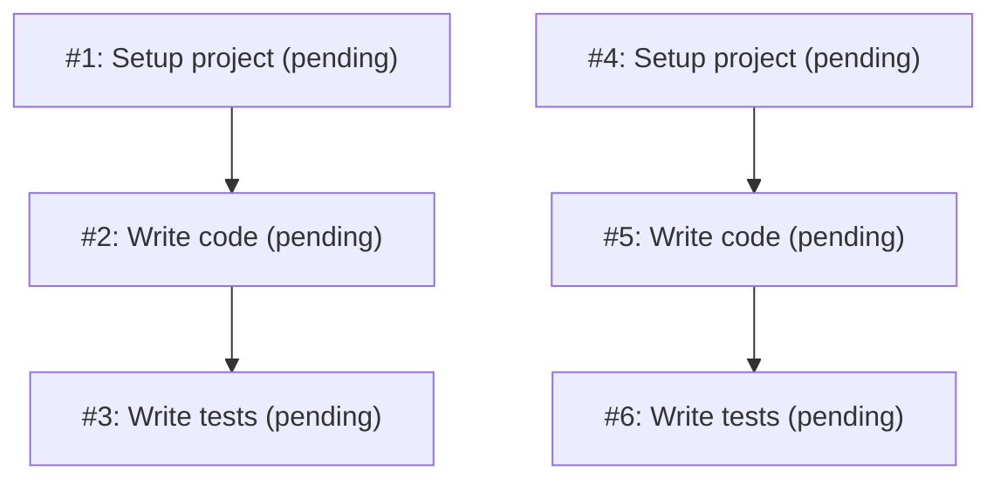

# Task Dependency Graph

## All Tasks
| ID | Subject        | Description                                  | Status   | Blocked By |
|----|----------------|----------------------------------------------|----------|------------|
| 1  | Setup project  | Set up the project structure and config      | pending  | []         |
| 2  | Write code     | Write the main code for the project          | pending  | [1]        |
| 3  | Write tests    | Write tests for the code                     | pending  | [2]        |
| 4  | Setup project  | Set up initial project structure and deps    | pending  | []         |
| 5  | Write code     | Write the main code for the project          | pending  | [4]        |
| 6  | Write tests    | Write tests for the project code             | pending  | [5]        |

## Dependency Graph

